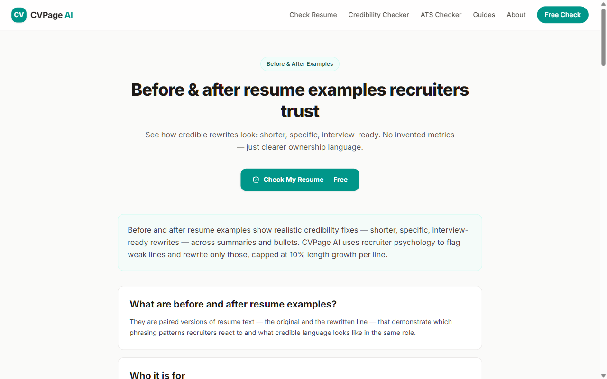
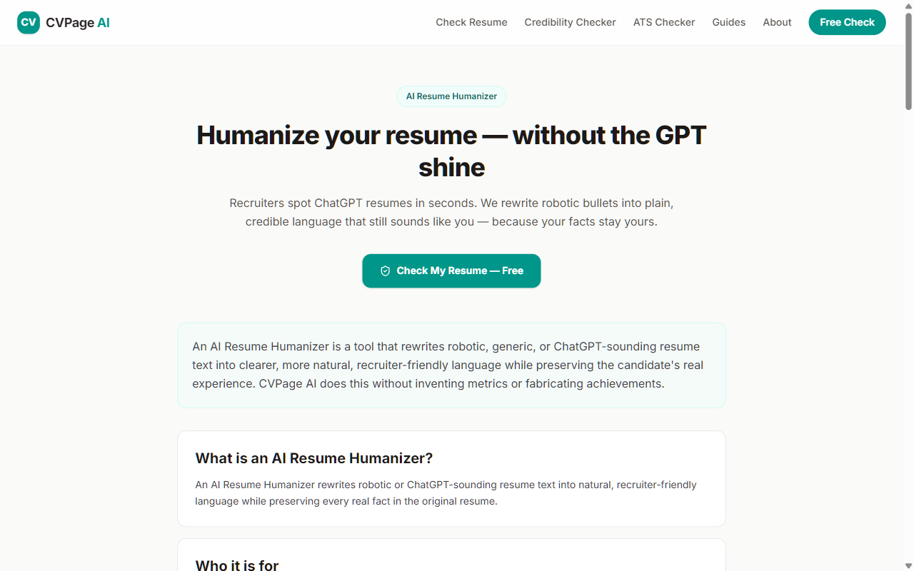
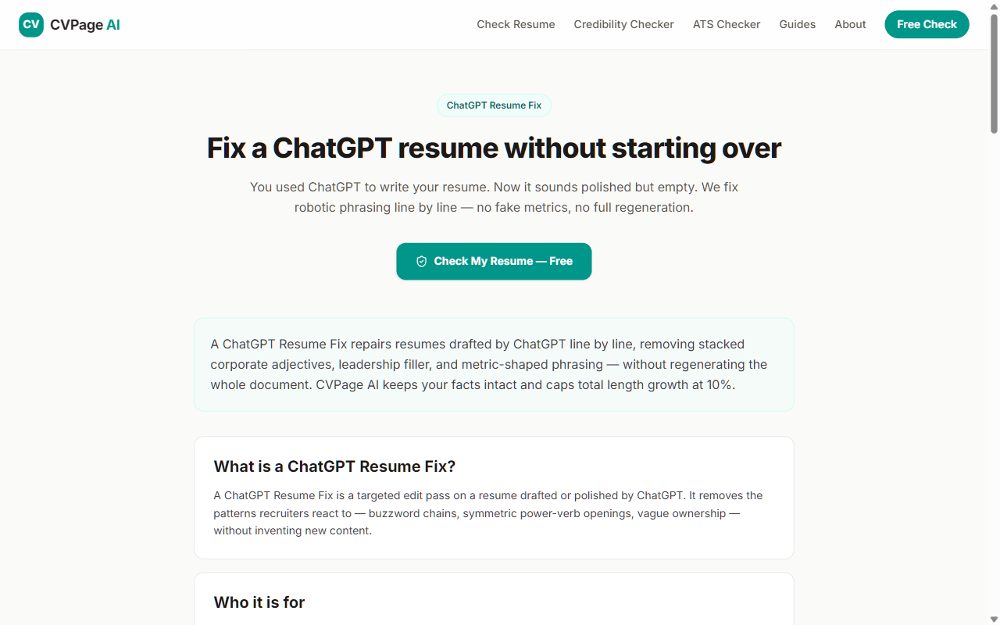
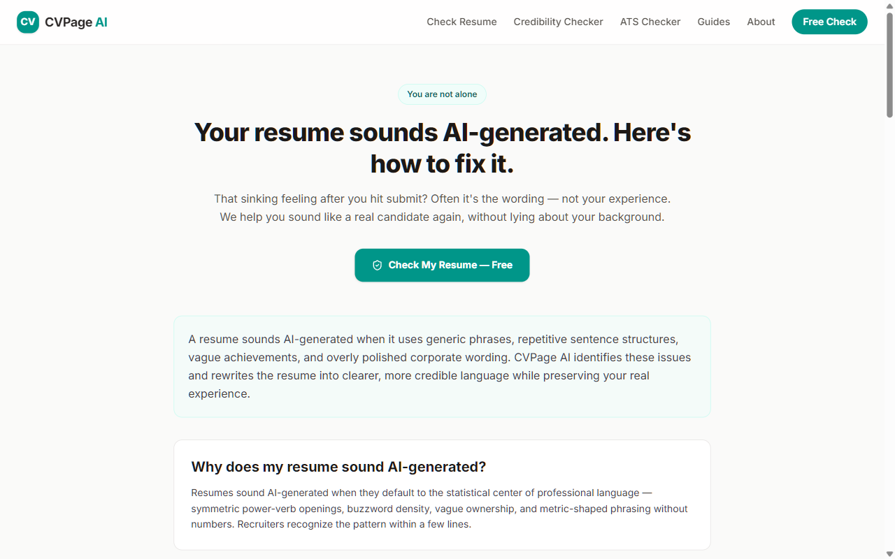

# ChatGPT Resume — Before/After Examples

> A catalog of resumes that ChatGPT wrote badly, the recruiter-grade rewrites that fix them, and line-by-line annotations explaining what changed and why.

This repo is a **reading resource**, not a tool. 33 full worked cases across 10 role categories, each one paired with a recruiter annotation. If you've ever asked "what's actually wrong with my AI-generated resume," every case here is one answer.

## Downloads

- [The 8 AI resume failure modes (PDF poster)](downloads/ai-resume-patterns-poster.pdf)
- [Same content as Markdown](downloads/ai-resume-patterns-poster.md)

## Live tool preview

The same logic in this repo powers [cvpage.org](https://cvpage.org):

These cases were curated against the same credibility heuristics used by the production pipeline at [cvpage.org](https://cvpage.org) — open-sourced here for anyone who'd rather learn from worked examples than blog posts.

---

## What's inside

| Folder | Cases | Roles covered |
| --- | --- | --- |
| [examples/engineering/](examples/engineering) | 6 | Junior, mid, senior, staff, platform, frontend |
| [examples/product/](examples/product) | 3 | Junior PM, senior PM, growth PM |
| [examples/marketing/](examples/marketing) | 3 | Demand gen, content, junior |
| [examples/sales/](examples/sales) | 3 | SDR, AE, sales leadership |
| [examples/design/](examples/design) | 3 | Product designer, senior designer, junior |
| [examples/operations/](examples/operations) | 3 | RevOps, BizOps, People Ops |
| [examples/data-analyst/](examples/data-analyst) | 3 | Junior, mid-level, ML-leaning senior |
| [examples/finance/](examples/finance) | 3 | FP&A, IB analyst, controller |
| [examples/customer-success/](examples/customer-success) | 3 | CSM, onboarding, technical CS |
| [examples/engineering-management/](examples/engineering-management) | 3 | EM, senior EM, director |
| [annotations/](annotations) | 2 docs | How recruiters read · What AI gets wrong |

---

## Three hero cases

Read these three to understand the pattern. The 18 others apply the same logic to different roles.

### Hero 1 — Backend engineer, senior

**Before (ChatGPT default):**

> Spearheaded the implementation of a robust, scalable microservices architecture, driving operational excellence and optimizing system performance for cross-functional stakeholders.

**After (recruiter-grade):**

> Split the checkout monolith into three services (orders, payments, fulfillment); owned the API contract with the mobile team.

**Why the after works:**

- Names the three services (recruiter can ask "what were the orders-service boundaries?")
- Names the actual collaborator (the mobile team)
- "Split" is a trusted, low-risk verb compared to "spearheaded"
- Zero buzzwords, 21 words instead of 28

Full annotated case: [examples/engineering/02-senior-backend.md](examples/engineering/02-senior-backend.md)

---

### Hero 2 — Product manager, growth

**Before:**

> Drove a 47% improvement in conversion through innovative, data-driven product enhancements and strategic cross-functional initiatives.

**After:**

> Rewrote the trial-to-paid conversion flow; A/B test showed a +47% lift in paid conversion over four weeks (significance: p<0.01).

**Why the after works:**

- 47% is now anchored to a specific test, with the duration and significance level
- "Innovative, data-driven product enhancements" → named the actual artifact (the conversion flow)
- "Cross-functional initiatives" → deleted
- A recruiter reading this can ask exactly one follow-up: "what was the variant?" and the candidate can answer

**Critical note:** if the 47% was a guess, the after should be:

> Rewrote the trial-to-paid conversion flow as one of three Q3 onboarding experiments.

This is the single most-faked PM bullet shape. Full annotated case: [examples/product/03-growth-pm.md](examples/product/03-growth-pm.md)

---

### Hero 3 — SDR

**Before:**

> Leveraged consultative outbound prospecting techniques to drive a robust pipeline and consistently exceed activity quotas.

**After:**

> Booked 24 meetings per quarter on average across FY24 (team baseline: 18); top of the team for two of four quarters.

**Why the after works:**

- "Consultative outbound prospecting" → named the deliverable (meetings booked)
- Anchored against the team baseline (18) — a credibility multiplier
- "Top of the team for two of four quarters" — defensible, non-fabricated, recruiter-meaningful
- "Robust pipeline" → deleted; meeting count is the real KPI

Full annotated case: [examples/sales/01-sdr.md](examples/sales/01-sdr.md)

---

## How to read this repo

Each case file follows the same five-section structure:

1. **The role context** — who wrote it, what they were applying for
2. **The ChatGPT-default version** — what came out of "ChatGPT, write me a resume for X"
3. **The recruiter-grade version** — what the rewrite looks like
4. **Line-by-line annotations** — what changed in each bullet and why
5. **What still wouldn't survive an interview** — the bullets that are still risky even after the rewrite

The fifth section is the one most resume-rewriting resources skip. It's where the real recruiter judgment lives.

---

## Two key reading documents

If you only have ten minutes:

- [annotations/how-recruiters-read.md](annotations/how-recruiters-read.md) — the actual reading path a recruiter uses in the 6-second scan, with annotated examples
- [annotations/what-ai-gets-wrong.md](annotations/what-ai-gets-wrong.md) — the eight most common LLM failure modes on resumes, with examples of each

---

## Who this is for

- **Job seekers** who got their resume back from ChatGPT and aren't sure why it feels off
- **Recruiters and resume writers** building their own example library
- **Bootcamp and career-coaching curriculum builders** (the examples are CC-friendly under MIT)
- **Researchers** studying LLM failure modes on resume tasks

---

## What this repo is NOT

- **Not a templates library.** Resume templates are a different problem. This repo is about rewriting *content*.
- **Not a fictional showcase.** The "ChatGPT-default" versions are real outputs from GPT-4 on real resume rewrite prompts. The "after" versions are the kind of rewrite a senior recruiter would produce.
- **Not a guide to faking experience.** Several cases explicitly call out where a metric was invented and how to honestly retract it.

---

## Roadmap

- [ ] Add data / analytics roles (3 cases)
- [ ] Add customer success roles (3 cases)
- [ ] Add engineering management roles (3 cases)
- [ ] Add career-switch case studies (junior PM coming from teaching, junior SWE coming from finance, etc.)
- [ ] Per-case downloadable PDF showing the before, after, and diff side by side

Contributions welcome. New cases should follow the existing five-section structure and respect the credibility rules from [`annotations/what-ai-gets-wrong.md`](annotations/what-ai-gets-wrong.md).

<!-- ===== SHARED FOOTER — copy verbatim into the bottom of every repo README ===== -->

---

## Related repositories

Part of an open resource set for resume credibility, ATS, and recruiter-grade rewriting:

- [ai-resume-humanizer-prompts](https://github.com/Sahme115/ai-resume-humanizer-prompts) — prompt library for rewriting AI-sounding resumes
- [chatgpt-resume-before-after-examples](https://github.com/Sahme115/chatgpt-resume-before-after-examples) — annotated bad-vs-improved resume samples
- [recruiter-resume-audit-framework](https://github.com/Sahme115/recruiter-resume-audit-framework) — 5-step framework recruiters actually use
- [ats-resume-keyword-dataset](https://github.com/Sahme115/ats-resume-keyword-dataset) — structured ATS keyword dataset by role
- [awesome-ai-resume-resources](https://github.com/Sahme115/awesome-ai-resume-resources) — curated list of prompts, tools, and recruiter resources

## Live tool

Try the full recruiter-grade audit pipeline (Analyze → Critique → Rewrite, no fabricated metrics):

**[https://cvpage.org](https://cvpage.org)**

Specific tools:

- [Resume Humanizer](https://cvpage.org/resume-humanizer) — rewrite ChatGPT-sounding bullets
- [ATS Resume Checker](https://cvpage.org/ats-resume-checker) — keyword + parse audit
- [Resume Credibility Checker](https://cvpage.org/resume-credibility-checker) — recruiter-style audit
- [ChatGPT Resume Fix](https://cvpage.org/chatgpt-resume-fix) — fix AI-generated drafts
- [Rewrite Resume Bullets](https://cvpage.org/rewrite-resume-bullets) — line-by-line rewriter

## Further reading

Deep-dive articles that pair with this repository:

- [Why recruiters hate AI-generated resumes](https://cvpage.org/blog/why-recruiters-hate-ai-generated-resumes)
- [Signs your resume sounds like ChatGPT](https://cvpage.org/blog/signs-your-resume-sounds-like-chatgpt)
- [AI resume vs human-written resume](https://cvpage.org/blog/ai-resume-vs-human-written-resume)
- [Why AI resumes feel generic](https://cvpage.org/blog/why-ai-resumes-feel-generic)
- [How recruiters spot fake resumes](https://cvpage.org/blog/how-recruiters-spot-fake-resumes)
- [What recruiters notice in 6 seconds](https://cvpage.org/blog/what-recruiters-notice-in-6-seconds)
- [Resume credibility signals](https://cvpage.org/blog/resume-credibility-signals)

## License

[MIT](./LICENSE) — free to fork, adapt, and use commercially. Attribution appreciated but not required.

## Contributing

Issues and PRs welcome. Please keep the quality bar high: examples must be realistic, prompts must be tested, and no keyword-stuffed contributions.
